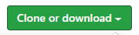

# Language Selector Quiz

#### Programming Language Quiz - Independent Project for Epicodus, 06.05.2020

## By Brittany Lindgren

## Description

If you're interested becoming a programmer, but are overwhelmed by the vast number of languages to choose from, you're not alone. Take this quiz to determine which language might be right for you.  

## Setup/Installation Requirements

1. Follow this [link to the project repository](https://github.com/LINDGRENBA/language-selector) on GitHub.

2. Click on the "Clone or download" button to copy the project link.
 

3. If you are comfortable with the command line, you can copy the project link and clone it through your commad line with the command `git clone`. Otherwise, I recommend choosing "**Download ZIP**". 

4. Once the ZIP file has finished downloading, you can right click on the file to view the zip folder in your downloads. 

5. Right click on the project ZIP folder that you have just downloaded and choose the option "**Copy To...**", then choose the location where you would like to save this folder. 

6. Navigate to the final location where you have chosen to save the project folder.

7. To view the code itself, right click, choose "open with..." and open using a text editor such as VS Code or Atom, etc.

#### Additional Setup/Installation Notes:

* You do not need to run a server to view this document.

* No additional code is necessary to view this project.   

## Specifications

#### Spec 1
* Behavior: Program gathers user input.
* Input Example: User selects 'a'.
* Output Example: Console.log(userinput) displays 'a'.

#### Spec 2
* Behavior: Program returns user input a, b or c as 0, 1 or 2 (in number form) respectively.
* Input Example: b
* Output Example: 1

#### Spec 3
* Behavior: Program adds user input and returns total.
* Input Example: a, a, b, c, c, a - (equivalent numbers = 0, 0, 1, 2, 2, 0)
* Output Example: 5

#### Spec 4
* Behavior: Program checks for specific range of numbers.
* Input Example: 0-4
* Output Example: "Low"

* Input Example: 5-8
* Output Example: "Medium"

* Input Example: 9-12
* Output Example: "High"

* Input Example: 13-16
* Output Example: "Extreme"

#### Spec 5
* Behavior: Program returns a string for a programming language depending on the range of numbers.
* Input Example: 0-4
* Output Example: "Python"

#### Spec 6
* Behavior: If program returns "python", result for python shows in index.html
* Input Example: "python"
* Output Example: Result: You should learn python!

## Known Bugs

There are no known bugs at this time.  

## Support and contact details

Please feel free to contact me through GitHub (username: LINDGRENBA) with any questions, ideas or concerns.  

## Technologies Used

* HTML5
* CSS3
* Bootstrap v-3.3.7
* JavaScript
* jQuery v-3.5.0
* Visual Studio Code  

### License

*This site is licensed under the MIT license.*

Copyright (c) 2020 **_Brittany A Lindgren_**